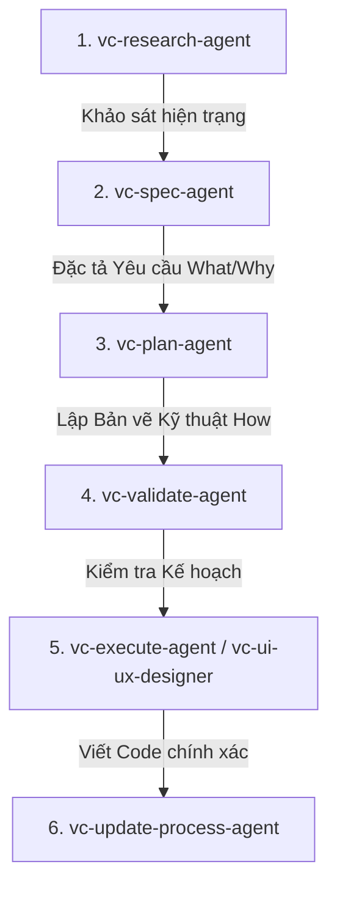

# 🤖 RIPER-5 Agent Workflow System (`.claude`)

Tài liệu hướng dẫn tổng quan về cấu trúc, chức năng các thành phần và thứ tự quy trình sử dụng hệ thống Agent tự động hóa trong thư mục `.claude`.

---

## 📁 1. Cấu trúc thư mục

```text
.claude/
├── settings.json                   # File cấu hình trung tâm (Hook registration)
├── agents/                         # Danh sách 15 AI Sub-Agents chuyên biệt
│   ├── vc-research-agent.md        # [Giai đoạn 1] Khảo sát & thu thập thông tin
│   ├── vc-spec-agent.md            # [Giai đoạn 2] Đặc tả yêu cầu (Product Specs)
│   ├── vc-innovate-agent.md        # [Giai đoạn 2.5] Khám phá & chọn giải pháp
│   ├── vc-plan-agent.md            # [Giai đoạn 3] Lập kế hoạch kỹ thuật chi tiết
│   ├── vc-validate-agent.md        # [Giai đoạn 4] Xác minh kế hoạch trước khi code
│   ├── vc-execute-agent.md         # [Giai đoạn 5] Thực thi viết code chính xác
│   ├── vc-update-process-agent.md  # [Giai đoạn 6] Cập nhật tiến độ & đóng gói
│   ├── vc-fast-mode-agent.md       # Luồng viết code nhanh cho tác vụ đơn giản
│   ├── vc-quick-fix-agent.md       # Sửa lỗi khẩn cấp / Patch nhỏ
│   ├── vc-debugger.md              # Chuyên gia tra vết & sửa lỗi runtime
│   ├── vc-tester.md                # Chuyên gia viết & chạy Unit/Integration Test
│   ├── vc-code-reviewer.md         # Review & kiểm tra chất lượng code
│   ├── vc-code-simplifier.md       # Tối ưu & dọn dẹp code thừa
│   ├── vc-ui-ux-designer.md        # Thiết kế & tối ưu giao diện UI/UX
│   └── vc-git-manager.md           # Quản lý commit, branch & luồng Git
├── hooks/                          # Các tập lệnh kiểm duyệt tự động (Automation Guards)
│   ├── session-init.cjs            # Khởi tạo dữ liệu khi bắt đầu phiên làm việc
│   ├── subagent-init.cjs           # Khởi tạo dữ liệu khi gọi Sub-agent
│   ├── privacy-block.cjs           # Chặn rò rỉ dữ liệu nhạy cảm / thông tin riêng tư
│   ├── scout-block.cjs             # Bắt buộc khảo sát dự án trước khi sửa code
│   ├── descriptive-name.cjs        # Bắt buộc đặt tên file rõ nghĩa khi tạo mới
│   ├── session-state.cjs           # Ghi nhớ trạng thái các file đã sửa trong phiên
│   ├── post-write-plan-check.mjs   # Kiểm tra tính hợp lệ của file Plan sau khi tạo
│   ├── post-edit-simplify-reminder.cjs # Nhắc nhở dọn dẹp code sau khi sửa
│   ├── post-commit-lint.mjs        # Tự động chạy Lint sau khi commit Git
│   └── stop-validator-sweep.cjs    # Kiểm tra tổng thể trước khi dừng lượt tương tác
└── skills/                         # 33 Kỹ năng chuyên sâu (Skills catalog)
    ├── vc-scout/                   # Kỹ năng tìm kiếm & định vị code
    ├── vc-frontend-design/         # Kỹ năng thiết kế giao diện cao cấp
    ├── vc-agent-browser/           # Kỹ năng chụp ảnh màn hình & test trình duyệt
    ├── vc-security/                # Kỹ năng rà soát bảo mật
    └── ... (các skills phụ trợ khác)
```

---

## 📄 2. Chi tiết chức năng từng file chính

### ⚙️ Cấu hình chung
- **`settings.json`**: Đăng ký các sự kiện vòng đời (`SessionStart`, `PreToolUse`, `PostToolUse`, `Stop`) để gọi các script trong thư mục `hooks/`.

### 🛡️ Thư mục `hooks/` (Scripts kiểm duyệt)
- **`privacy-block.cjs`**: Ngăn chặn AI truy cập hoặc ghi đè các file chứa thông tin nhạy cảm (API keys, secrets, `.env`).
- **`scout-block.cjs`**: Đảm bảo AI không được sửa code "đoán mò" mà phải khảo sát cấu trúc dự án trước (`vc-scout`).
- **`descriptive-name.cjs`**: Ngăn chặn tạo các file rác hoặc đặt tên chung chung như `test.js`, `temp.txt`.
- **`post-write-plan-check.mjs`**: Đảm bảo các bản kế hoạch (Plan) do `vc-plan-agent` viết ra có đầy đủ các mục tiêu chí nghiệm thu.
- **`stop-validator-sweep.cjs`**: Rà soát lại xem AI đã hoàn thành hết các checklist cam kết trước khi trả quyền lại cho người dùng.

---

## 🔄 3. Thứ tự quy trình sử dụng (Quy chuẩn RIPER-5)

Hệ thống hoạt động theo **luồng 6 bước nghiêm ngặt** để đảm bảo code ra tới đâu chuẩn tới đó:



### 📌 Các bước chi tiết:

1. **Bước 1: Khảo sát (`vc-research-agent`)**
   - *Khi nào dùng:* Đầu dự án hoặc khi chuẩn bị làm một tính năng mới.
   - *Nhiệm vụ:* Đọc codebase, tìm hiểu thư viện, ghi nhận hiện trạng. Không sửa code, không đề xuất giải pháp.

2. **Bước 2: Đặc tả Yêu cầu (`vc-spec-agent`)**
   - *Khi nào dùng:* Sau khi đã có thông tin khảo sát.
   - *Nhiệm vụ:* Viết tài liệu `SPEC` miêu tả tính năng dưới dạng User Story & Acceptance Criteria để người dùng xem và duyệt.

3. **Bước 3: Lập Kế hoạch Kỹ thuật (`vc-plan-agent`)**
   - *Khi nào dùng:* Sau khi người dùng đã duyệt `SPEC`.
   - *Nhiệm vụ:* Viết file `PLAN` chi tiết từng file cần sửa, cấu trúc hàm, API endpoint, kế hoạch test.

4. **Bước 4: Xác minh Kế hoạch (`vc-validate-agent`)**
   - *Khi nào dùng:* Trước khi viết code.
   - *Nhiệm vụ:* Rà soát lại bản `PLAN` xem có rủi ro, thiếu sót hay xung đột kiến trúc nào không.

5. **Bước 5: Thực thi Viết Code (`vc-execute-agent` / `vc-ui-ux-designer`)**
   - *Khi nào dùng:* Khi bản `PLAN` đã sẵn sàng.
   - *Nhiệm vụ:* 
     - Dùng `vc-execute-agent` để viết logic backend, database, thuật toán theo đúng PLAN.
     - Dùng `vc-ui-ux-designer` nếu bài toán liên quan đến làm giao diện Frontend/CSS/Design Tokens.

6. **Bước 6: Tổng kết & Cập nhật (`vc-update-process-agent`)**
   - *Khi nào dùng:* Sau khi code xong và test vượt qua.
   - *Nhiệm vụ:* Cập nhật tiến độ vào hệ thống, lưu báo cáo và đóng Task.

---

### ⚡ Các luồng tắt (Shortcut Workflows)
- **Sửa lỗi khẩn cấp:** Gọi `vc-debugger` $\rightarrow$ `vc-quick-fix-agent`.
- **Viết tính năng nhỏ/đơn giản:** Dùng `vc-fast-mode-agent`.
- **Review & Tối ưu code:** Dùng `vc-code-reviewer` & `vc-code-simplifier`.
